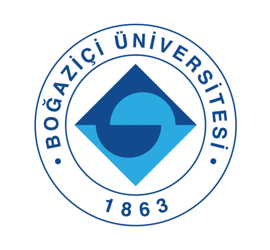

# Introduction

This repository is created for SWE-573 Project given in Bogazici University, Fall Semester 2022.

The purpose of this project is to develop a software product, beginning from requirements gathering to deployment. 

This project aims to create a system that facilitates different users to aggregate information that they have encountered during their social media or interactive media interaction under a hub.

Application proposes a solution to save social media or interactive media interactions of each user indefinitely, and to create an environment to track, copy and commend on users' daily social media interactions that they find useful.

The proposed project shall be able to put social and interactive media information that each users have collected on a web application. Furthermore, project will enable users to share, tag and label [recommending, reading, thinking] the information with other users.

The main drivers of the project are users and they will bring the content to the web application.

For detailed explanation please see project's [Description](https://github.com/eralp85/SWE-573.01/wiki/2.2-Project-Description#description), [Requirements](https://github.com/eralp85/SWE-573.01/wiki/2.3-Requirements#requirments),
and [Mock-UP](https://github.com/eralp85/SWE-573.01/wiki/3.-Mock-Up) Wiki Pages.

Django frame will be used for the project. 
MySQL will be used for database management.
Docker containers will be used.

Any relevant content will be available on this platform. 

Project will continuously be updated on [GitHub project repository](https://github.com/eralp85/SWE-573.01).

[Eralp Unver](https://github.com/eralp85) will be maintaining the project.

This project is under supervision of [Suzan Uskudarli](https://github.com/uskudarli) .